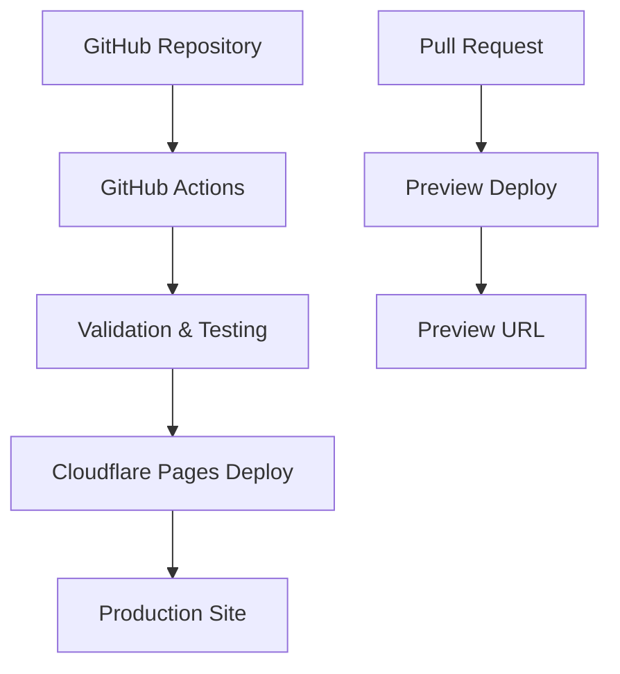

# 🚀 Deployment Guide

## Automatic Deployment Status

✅ **Active**: Automatic deployment to Cloudflare Pages  
🌐 **Live Site**: [thefladil.site](https://thefladil.site)  
⚡ **Build Time**: ~30 seconds  
🔄 **Auto-Deploy**: Enabled on `main` branch pushes  

## Deployment Architecture



## Configuration Files

### 🔧 Core Configuration
- **`wrangler.toml`**: Cloudflare Workers/Pages configuration
- **`.pages.toml`**: Pages-specific build settings
- **`_headers`**: Security headers and caching rules
- **`.htmlhintrc`**: HTML validation rules

### 📋 Deployment Settings
```yaml
Framework: None (Static Site)
Build Command: (empty)
Output Directory: /
Node Version: 18
Environment: Production
```

## Deployment Triggers

### 🚦 Automatic Triggers
1. **Main Branch Push** → Production deployment
2. **Pull Request** → Preview deployment
3. **Manual Trigger** → On-demand deployment

### 🔍 Validation Pipeline
1. **HTML Validation** → HTMLHint checks
2. **File Structure** → Required files verification
3. **Mobile-First** → Responsive design validation
4. **Accessibility** → Basic accessibility checks

## Environment Variables

Required secrets in GitHub repository:
- `CLOUDFLARE_API_TOKEN`: API token for deployment
- `CLOUDFLARE_ACCOUNT_ID`: Account ID for Pages project

## Monitoring & Verification

### 📊 Post-Deploy Checks
- Site accessibility verification
- Mobile-first design validation
- Security headers verification
- PWA manifest validation

### 🔍 Performance Monitoring
- Build time tracking
- Deployment success rate
- Site response time checks

## Manual Deployment

### Option 1: Wrangler CLI
```bash
# Install Wrangler
npm install -g wrangler

# Deploy to production
wrangler pages deploy . --project-name=dr-fadil-profile
```

### Option 2: GitHub Actions (Manual)
```bash
# Trigger manual deployment
gh workflow run "🚀 Deploy & Verify"
```

### Option 3: Cloudflare Dashboard
1. Visit [Cloudflare Pages Dashboard](https://dash.cloudflare.com/pages)
2. Select `dr-fadil-profile` project
3. Click "Create deployment"
4. Choose deployment source

## Troubleshooting

### Common Issues

**Build Failures**
- Check file structure validation
- Verify HTML syntax with HTMLHint
- Ensure all required files are present

**Deployment Delays**
- DNS propagation may take up to 24 hours
- Cloudflare cache may need clearing
- Check Cloudflare Pages status

**Security Headers**
- Verify `_headers` file syntax
- Check header conflicts with existing rules
- Test headers with security scanners

### Debug Commands
```bash
# Check deployment status
curl -I https://thefadil.site

# Verify headers
curl -v https://thefladil.site 2>&1 | grep -i "x-"

# Test mobile viewport
curl -s https://thefladil.site | grep viewport
```

## Performance Optimization

### 🚀 Current Optimizations
- Static site generation (no build process)
- Cloudflare global CDN
- Aggressive caching for static assets
- Service worker for offline support
- Gzip/Brotli compression
- HTTP/2 server push

### 📱 Mobile-First Features
- Responsive breakpoints (480px, 768px, 1200px)
- Touch-friendly 44px minimum touch targets
- Optimized images and fonts
- Progressive enhancement

## Security Features

### 🔒 Security Headers
- Content Security Policy (CSP)
- X-Frame-Options: DENY
- X-Content-Type-Options: nosniff
- Strict Transport Security (HSTS)
- Referrer Policy
- Permissions Policy

### 🛡️ Additional Security
- No sensitive data in repository
- Secure service worker implementation
- HTTPS enforcement
- CORS configuration

---

**Last Updated**: 2025-07-31  
**Maintained By**: Dr. Mohamed Al Fadil  
**Contact**: [Fadil369@hotmail.com](mailto:Fadil369@hotmail.com)